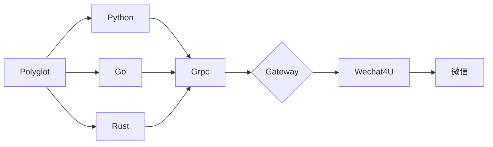

## Go-Wechaty-Bot 4U PROTOCOL

[](/tree/4u)

> 仅供学习使用，*请勿用于非法用途*！

[1]: https://img.shields.io/badge/puppet-xp-blue
[2]: https://img.shields.io/badge/puppet-padlocal-blue
[3]: https://img.shields.io/badge/puppet-4u-blue
[5]: https://github.com/XRSec/gobot/tree/xp
[6]: https://github.com/XRSec/gobot/tree/padlocal
[7]: https://github.com/XRSec/gobot/tree/4u

[![puppet-xp][1]][5] 〰️ [![puppet-padlocal][2]][6] 〰️ [![puppet-4u][3]][7] 「 Select Gateway 」

## Info

### Glossary

```ini
Gateway : puppet-wechat4u
Server: go-wechaty
```

### Architecture



## ⇲ Use

### Init (depend main.General)

1. Checkout branch

   ```bash
   git checkout 4u
   ```

2. Generate Token

   ```bash
   # Generate Token
   WECHATY_TOKEN：curl -s https://www.uuidgenerator.net/api/version4
   WECHATY_PUPPET_SERVICE_TOKEN："insecure_" + WECHATY_TOKEN
   # WECHATY_TOKEN WECHATY_PUPPET_SERVICE_TOKEN 可同可不同
   ```

3. Modifying a Configuration File
   ```bash
   # wechatyGateway.bat
   @set WECHATY_TOKEN=5f3029c0-0f46-4436-bdc6-02efcbad3309
   @set WECHATY_PUPPET_SERVICE_TOKEN=insecure_34bf8353-0874-4b29-851d-e8a2502fc747
   @set WECHATY_PUPPET_SERVER_PORT=25000
   ```
4. Install the Software ([**WeChat.exe Check Download**](https://github.com/wechaty/wechaty-puppet-xp/releases/download/v0.5/WeChatSetup-v3.3.0.115.exe))
   ```bash
   > node-v16.exe WeChatSetup-v3.3.0.115.exe
   > @cnpm install -g windows-build-tools
   > @cnpm install -g wechaty wechaty-puppet-xp
   ```
5. Optional operation
   ```bash
   # Set Environment
   @chdir
   # Google: How to set the path and environment variables in Windows
   ```


### Start Server

```bash
.\wechaty.bat # Start puppet-xp Gateway
make server # Start Server
```
