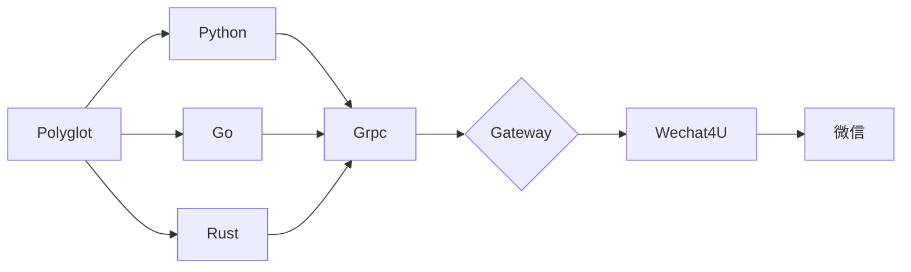

## Go-Wechaty-Bot 4U PROTOCOL

> 仅供学习使用，*请勿用于非法用途*！

[1]: https://img.shields.io/badge/puppet-xp-blue
[2]: https://img.shields.io/badge/puppet-padlocal-blue
[3]: https://img.shields.io/badge/puppet-4u-blue
[5]: https://github.com/XRSec/Go-Wechaty-Bot-XP
[6]: https://github.com/XRSec/Go-Wechaty-Bot/tree/main/padlocal#go-wechaty-bot-padlcoal-protocol
[7]: https://github.com/XRSec/Go-Wechaty-Bot/tree/main/4u#go-wechaty-bot-4u-protocol

[![puppet-xp][1]][5] 〰️ [![puppet-padlocal][2]][6] 〰️ [![puppet-4u][3]][7] 「 Select Gateway 」

## Info

### Glossary

```ini
Gateway : puppet-wechat4u
Server: go-wechaty
```

### Architecture



## ⇲ Use

### Init (depend main.General)

1. Checkout branch

   ```bash
   cd 4u
   ```

2. Generate Token

   ```bash
   # Generate Token
   WECHATY_TOKEN：curl -s https://www.uuidgenerator.net/api/version4
   WECHATY_PUPPET_SERVICE_TOKEN："insecure_" + WECHATY_TOKEN
   # WECHATY_TOKEN WECHATY_PUPPET_SERVICE_TOKEN 可同可不同
   ```

3. Modifying a Configuration File

   ```bash
   # wechatyGateway.bat
   @set WECHATY_TOKEN=5f3029c0-0f46-4436-bdc6-02efcbad3309
   @set WECHATY_PUPPET_SERVICE_TOKEN=insecure_34bf8353-0874-4b29-851d-e8a2502fc747
   @set WECHATY_PUPPET_SERVER_PORT=25000
   ```

<!-- 4. Install the Packages

   ```bash
   # node-v16
   npm install -g wechaty wechaty-puppet-xp
   # npm --registry http://registry.npmmirror.com install -g wechaty-puppet-xp
   ``` -->

### Start Server

```bash
cd 4u && bash ./wechatyGateway.sh # Start puppet-wechat4u Gateway
cd server && go run main.go # Start Server
```
