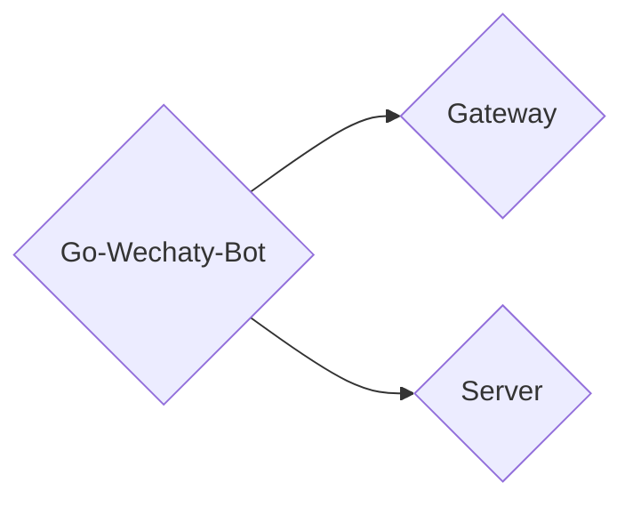
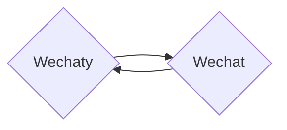
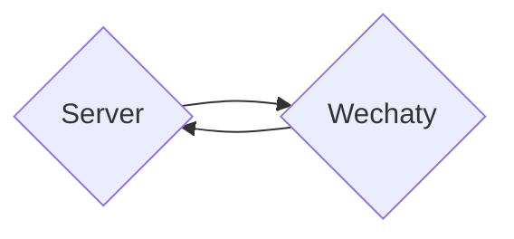
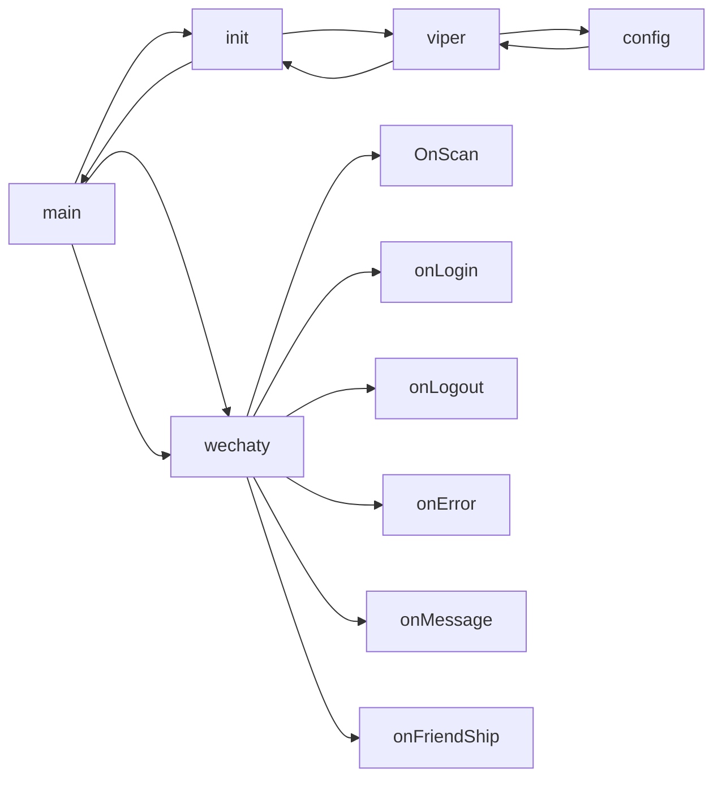
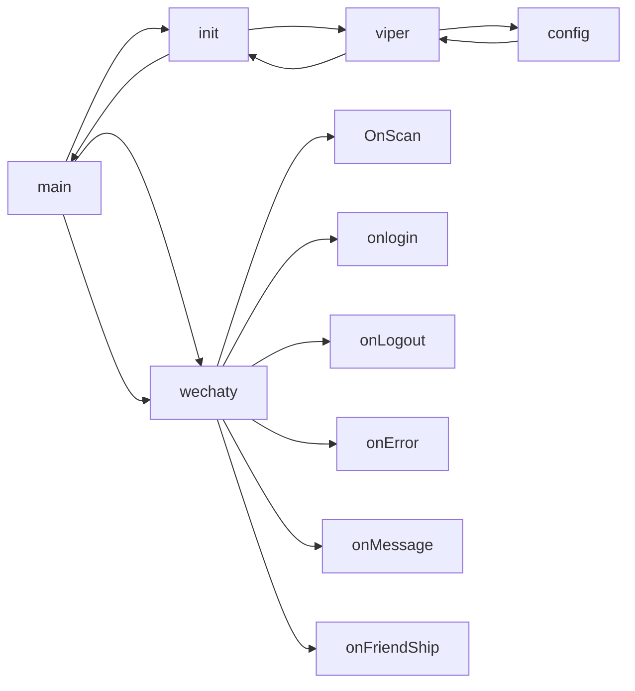
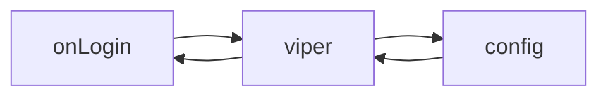
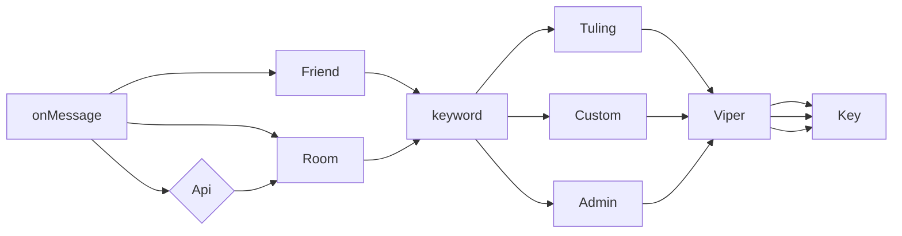
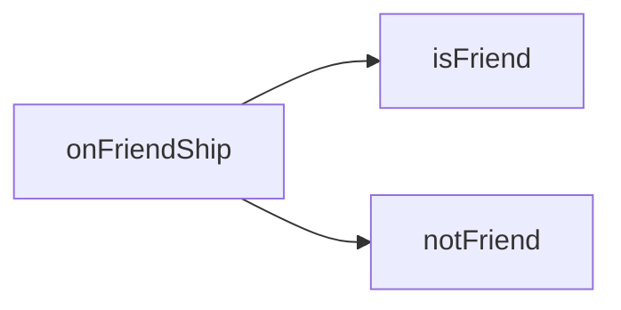
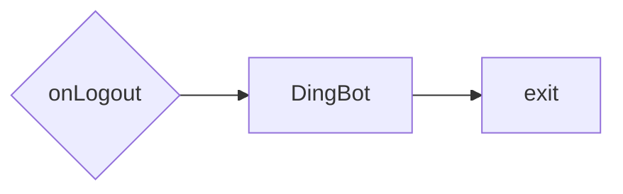

# Go-Wechaty-Bot

```mermaid
flowchart LR
    Go-Wechaty-Bot{Go-Wechaty-Bot}-->Gateway{Gateway};
    Go-Wechaty-Bot{Go-Wechaty-Bot}-->Server{Server};
```

## Gateway

```mermaid
flowchart LR
    Gateway{Gateway}-->Wechat{Wechat}-->Gateway{Wechaty};
```

## Server

```mermaid
flowchart LR
    Server{Server}-->Gateway{Wechaty}-->Server{Server};
```

### Init

```mermaid
flowchart LR
    main-->init-->viper-->config;
    config-->viper-->init-->main;
    main-->wechaty-->web[OnScan];
    main-->wechaty-->onLogin;
    wechaty-->onLogout;
    wechaty-->onError;
    wechaty-->onMessage;
    wechaty-->onFriendShip
```

### Main

```mermaid
flowchart LR
    main-->init-->viper-->config;
    config-->viper-->init-->main;
    main-->wechaty-->web[OnScan];
    main-->wechaty-->onlogin;
    wechaty-->onLogout;
    wechaty-->onError;
    wechaty-->onMessage;
    wechaty-->onFriendShip
```

#### onLogin

```mermaid
flowchart LR
    onLogin-->viper-->config-->viper-->onLogin
```

#### onMessage

```mermaid
flowchart LR
    onMessage-->Room
    onMessage-->Friend
    Friend-->keyword
    Room-->keyword
    keyword-->Admin
    keyword-->Custom
    keyword-->Tuling
    Tuling-->Viper-->Key
    Custom-->Viper-->Key
    Admin-->Viper-->Key
    onMessage-->消息订阅推送{Api}-->Room
```

#### onFriendShip

```mermaid
flowchart LR
    onFriendShip-->isFriend
    onFriendShip-->notFriend
```

#### onLogout

```mermaid
flowchart LR
    账户退出{onLogout}-->DingBot-->exit
```