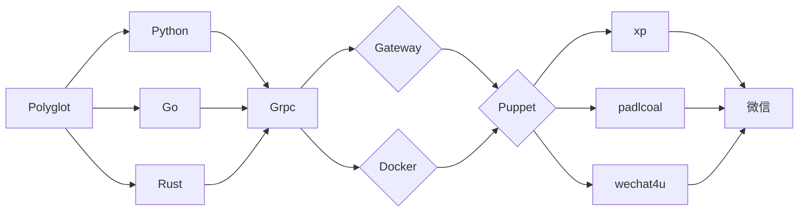

## Go-Wechaty-Bot

> 仅供学习使用，*请勿用于非法用途*！

[1]: https://img.shields.io/badge/puppet-xp-blue
[2]: https://img.shields.io/badge/puppet-padlocal-blue
[3]: https://img.shields.io/badge/puppet-4u-blue
[5]: https://github.com/XRSec/Go-Wechaty-Bot-XP
[6]: https://github.com/XRSec/Go-Wechaty-Bot/tree/main/padlocal#go-wechaty-bot-padlcoal-protocol
[7]: https://github.com/XRSec/Go-Wechaty-Bot/tree/main/4u#go-wechaty-bot-4u-protocol

[![puppet-xp][1]][5] 〰️ [![puppet-padlocal][2]][6] 〰️ [![puppet-4u][3]][7] 「 Select Gateway 」

## Architecture



## General

1. Clone Repo

   ```bash
   git clone https://github.com/XRSec/Go-Wechaty-Bot.git
   cd Go-Wechaty-Bot
   git submodule update --init --recursive
   ```

2. Install the Packages ( [! Docker](https://github.com/XRSec/Go-Wechaty-Bot/blob/main/padlocal/wechatyGateway.sh))

   ```bash
   # node-v16
   npm --registry http://registry.npmmirror.com install -g wechaty
   ```

3. Edit `Server/config.yaml`.

   ```yaml
   bot:
     adminid: wxid_xxxxx
     name: xxxxxxxx
   ding:
     keyword: Wechaty
     token: xxxxxxxxxxxxxxxxxx
     url: https://oapi.dingtalk.com/robot/send?access_token=
   tuling:
     token: xxxxxxxxxxxxxxxx&info=
     url: http://www.tuling123.com/openapi/api?key=
   wechaty:
     wechaty_puppet_endpoint: 127.0.0.1:25001
     wechaty_puppet_service_token: insecure_xxxxxxxxxxxxxxxxxxxxxx
   wxopenai:
     env: online
     token: xxxxxxxxxxxxxxxxxxxxx
   ```

4. Checking the Network Environment

   ```go
   if Gateway.IP = Server.IP {
    IP = NAT_IP // 192.168.0.10
    return // pass port
   } else {
    IP = InterNet_IP // curl cip.cc | https://ip.skk.moe/
   }
   
   if PORT on Server is open {
    continue
   } else {
    os.exit(0) // port can't vist
   }
   // ncat ip port -vv   // test
   ```

## ⚓️ Re

1. [wechat-bot](https://github.com/cixingguangming55555/wechat-bot/blob/master/pic/doc.md)

2. [puppet-services](https://wechaty.js.org/docs/puppet-services/diy/#all-in-one-command)

3. [issues](https://github.com/wechaty/puppet-xp/issues/38)

## ⚠️ Debug

1. Network

   ```bash
   curl cip.cc
   curl -s https://api.chatie.io/v0/hosties/[WECHATY_TOKEN]
   ```

2. Help me improve this project

3. Submit bugs and interesting features

## Update Repo

1. TODO && example.yaml
2. Update.md && Log.md

## Contact me

Reply to group chat with us


