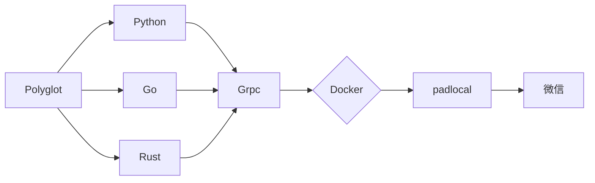

## Go-Wechaty-Bot PADLCOAL PROTOCOL

> 仅供学习使用，*请勿用于非法用途*！

[1]: https://img.shields.io/badge/puppet-xp-blue
[2]: https://img.shields.io/badge/puppet-padlocal-blue
[3]: https://img.shields.io/badge/puppet-4u-blue
[5]: /xp#go-wechaty-bot-xp-protocol
[6]: /padlocal#go-wechaty-bot-padlcoal-protocol
[7]: /4u#go-wechaty-bot-4u-protocol

[![puppet-xp][1]][5] 〰️ [![puppet-padlocal][2]][6] 〰️ [![puppet-4u][3]][7] 「 Select Gateway 」

## Info

### Glossary

```ini
Gateway : puppet-padlocal
Server: go-wechaty
```

### Architecture



## ⇲ Use

### Init (depend main.General)

1. Checkout branch

   ```bash
   cd padlocal
   ```

2. Get & Generate Token

   ```bash
   WECHATY_PUPPET_PADLOCAL_TOKEN: http://pad-local.com/#/tokens
   WECHATY_TOKEN："insecure_" + curl -s https://www.uuidgenerator.net/api/version4
   WECHATY_PUPPET_SERVICE_TOKEN：WECHATY_TOKEN
   ```

3. Modifying a Configuration File

   ```bash
   # wechatyGateway.sh
   export WECHATY_TOKEN="insecure_xxxxxxxx_xxxx_xxxx"
   export WECHATY_PUPPET_PADLOCAL_TOKEN="puppet_padlocal_xxxxxxxxxxxxxxxx"
   export WECHATY_PUPPET_SERVER_PORT="25000"
   ```

<!-- 4. Install the Packages

   ```bash
   # node-v16
   npm install -g wechaty-puppet-padlocal
   # npm --registry http://registry.npmmirror.com install -g wechaty-puppet-padlocal
   ``` -->

### Start Server

```bash
cd padlocal && npm install && bash ./wechatyGateway.sh # Start puppet-padlocal Gateway
cd server && go run main.go # Start Server
```
